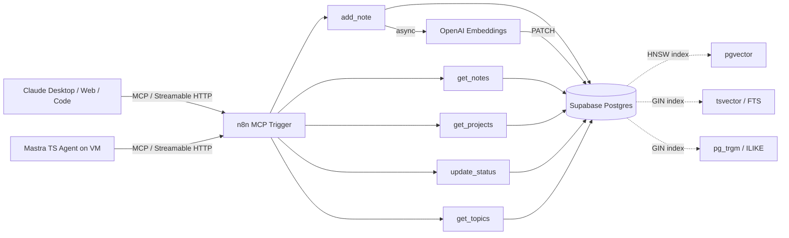

# petrenko-notes-mcp

A production MCP server backing a personal AI knowledge layer. Built on n8n, Supabase, and pgvector with a 3-channel hybrid search.

Part of Numen, a personal AI knowledge platform that combines note storage, semantic retrieval, agent memory, and forecast tracking.

---

## Why

Long-running interactions with LLM assistants need durable memory. Chat tools forget after a session. Naive embedding-only search has known weaknesses: exact technical terms, mixed-language queries (Russian and English in the same note), proper nouns, short queries.

This repo is the read/write layer that any Claude conversation can call through MCP. Notes go in, notes come out, search ranks them by combining three signals instead of one.

---

## Architecture



The MCP trigger in n8n exposes 5 tools over Streamable HTTP. Each tool runs as an isolated sub-workflow. Writes hit Supabase first, then enqueue an embedding job (so the user-facing call stays fast). Reads use a single Postgres RPC that runs all three search channels in parallel and fuses them.

### Production clients

The server is consumed by two independent clients in production:

- **Claude** (Desktop, Web, Claude Code) — through native MCP integration
- **Standalone TypeScript agent** built on the [Mastra](https://mastra.ai) framework, deployed on a VM and accessing the server over Streamable HTTP

Two clients on different stacks prove the server is not tightly coupled to a specific runtime. Adding a third (e.g. a Python agent) is a transport-only change.

Mastra integration looks like this:

```typescript
import { Agent } from "@mastra/core/agent";
import { MCPClient } from "@mastra/mcp";
import { anthropic } from "@ai-sdk/anthropic";

const mcp = new MCPClient({
  servers: {
    petrenkoNotes: {
      url: new URL(process.env.PETRENKO_NOTES_MCP_URL!),
    },
  },
});

const tools = await mcp.getTools();

const agent = new Agent({
  name: "vix",
  instructions: "Personal assistant agent. Use petrenko_notes tools to recall context, log decisions, and track tasks.",
  model: anthropic("claude-opus-4-7"),
  tools,
});

const result = await agent.generate("What did I decide about the voice agent POC last week?");
```

Full working example is in [`examples/mastra_client.ts`](./examples/mastra_client.ts).

For the detailed n8n workflow architecture — the main MCP Trigger router and the 5 sub-workflows that handle each tool — see [`docs/workflows.md`](./docs/workflows.md).

A representative n8n sub-workflow showing how the `get_notes` MCP tool is wired together (embedding generation + RPC call + response formatting) is in [`examples/n8n/`](./examples/n8n/).

---

## Stack

- **Orchestration**: n8n (workflow runtime, MCP server transport)
- **Database**: Supabase (Postgres 15, pgvector, pg_trgm)
- **Embeddings**: OpenAI `text-embedding-3-small`, 1536 dimensions
- **Search fusion**: Reciprocal Rank Fusion (RRF) in a single SQL RPC
- **Protocol**: MCP over SSE / Streamable HTTP

---

## MCP Tools

| Tool | Purpose |
|------|---------|
| `add_note` | Append a note (topic, content, type, project, source). Embedding is generated async. |
| `get_notes` | Hybrid search across topic + content. Filters by type, status, project. |
| `get_projects` | List active projects with note counts. |
| `update_status` | Change note status (`new`, `in_progress`, `done`, `cancelled`). Append-only history. |
| `get_topics` | Aggregate analytics — top projects, type distribution, recent themes. |

Each tool has a typed JSON Schema input. Errors return structured responses, not raw stack traces.

---

## Search Algorithm — Why 3-Channel RRF

Single-channel search has gaps:

- **Vector alone** fails on exact technical terms ("MCP", "pgvector", "RRF") and proper nouns. Embeddings smooth those into surrounding context.
- **FTS alone** fails on paraphrases. A query for "knowledge management" misses a note titled "persistent memory layer".
- **ILIKE alone** fails on conceptual queries. "How do I rank search results" finds nothing relevant.

The fix is to run all three and fuse the rankings.

### Channel definitions

| Channel | Index | Weight | Strength |
|---------|-------|--------|----------|
| ILIKE (trigram) | `gin_trgm_ops` on `topic \|\| content` | 2.0 | Exact and partial string match, language-agnostic |
| FTS | `gin` on generated `tsvector` column | 1.0 | Tokenized full-text, stemming |
| Vector cosine | HNSW on `embedding` | 1.0 | Semantic similarity, paraphrase tolerance |

ILIKE gets the highest weight because exact matches are almost always what the user wanted. The two semantic channels balance each other.

### RRF formula

```
score(doc) = SUM_over_channels(  weight / (k + rank_in_channel) )
```

with `k = 60` (standard, dampens contribution from low ranks).

### Why this works

Take the query `"MCP server architecture"`:

- ILIKE finds notes that literally mention `MCP` or `architecture`
- Vector finds notes about "Model Context Protocol design" even without the acronym
- FTS finds notes where `сервер` or `architecture` appear in any form

All three lists are short. RRF ranks docs that show up in multiple channels above docs that show up in only one. The result is a relevance order that respects both literal matches and semantic intent.

### Reference RPC (Postgres)

```sql
create or replace function public.search_notes(
  query_text   text,
  query_embedding vector(1536),
  match_count  int default 10,
  type_filter  text default null,
  status_filter text default null,
  project_filter text default null
)
returns table (
  id uuid,
  topic text,
  content text,
  type text,
  status text,
  project text,
  similarity float,
  rrf_score float
)
language sql stable as $$
with
ilike_rank as (
  select id, row_number() over (order by similarity(topic || ' ' || content, query_text) desc) as r
  from petrenko_notes
  where (topic || ' ' || content) % query_text
    and (type_filter is null or type = type_filter)
    and (status_filter is null or status = status_filter)
    and (project_filter is null or project = project_filter)
  limit 50
),
fts_rank as (
  select id, row_number() over (order by ts_rank(fts, plainto_tsquery('public.msg_search', query_text)) desc) as r
  from petrenko_notes
  where fts @@ plainto_tsquery('public.msg_search', query_text)
    and (type_filter is null or type = type_filter)
    and (status_filter is null or status = status_filter)
    and (project_filter is null or project = project_filter)
  limit 50
),
vec_rank as (
  select id, row_number() over (order by embedding <=> query_embedding) as r
  from petrenko_notes
  where embedding is not null
    and (type_filter is null or type = type_filter)
    and (status_filter is null or status = status_filter)
    and (project_filter is null or project = project_filter)
  limit 50
),
fused as (
  select n.id,
         coalesce(2.0 / (60 + i.r), 0) +
         coalesce(1.0 / (60 + f.r), 0) +
         coalesce(1.0 / (60 + v.r), 0) as rrf_score
  from petrenko_notes n
  left join ilike_rank i on i.id = n.id
  left join fts_rank   f on f.id = n.id
  left join vec_rank   v on v.id = n.id
  where i.id is not null or f.id is not null or v.id is not null
)
select n.id, n.topic, n.content, n.type, n.status, n.project,
       1 - (n.embedding <=> query_embedding) as similarity,
       fused.rrf_score
from fused
join petrenko_notes n on n.id = fused.id
order by fused.rrf_score desc
limit match_count;
$$;
```

---

## Schema

```sql
create extension if not exists vector;
create extension if not exists pg_trgm;

create table petrenko_notes (
  id           uuid primary key default gen_random_uuid(),
  topic        text not null,
  content      text not null,
  type         text not null check (type in ('decision','insight','idea','task','journal','to_study','contact_note','question')),
  status       text not null default 'new' check (status in ('new','in_progress','done','cancelled')),
  project      text not null,
  source       text not null default 'claude_chat',
  author       text,
  volatility   text default 'stable' check (volatility in ('stable','volatile')),
  related_ids  uuid[] default '{}',
  embedding    vector(1536),
  fts          tsvector generated always as (
                 to_tsvector('public.msg_search',
                   coalesce(topic, '') || ' ' || coalesce(content, ''))
               ) stored,
  valid_from   timestamptz not null default now(),
  valid_to     timestamptz,
  created_at   timestamptz not null default now(),
  updated_at   timestamptz not null default now()
);

create index idx_pn_embedding on petrenko_notes using hnsw (embedding vector_cosine_ops);
create index idx_pn_fts       on petrenko_notes using gin (fts);
create index idx_pn_trgm      on petrenko_notes using gin ((topic || ' ' || content) gin_trgm_ops);
create index idx_pn_type      on petrenko_notes (type);
create index idx_pn_status    on petrenko_notes (status);
create index idx_pn_project   on petrenko_notes (project);
create index idx_pn_created   on petrenko_notes (created_at desc);
```

`valid_from` / `valid_to` give append-only versioning. Status changes write a new row instead of mutating the old one. Useful for audit and for "show me what I believed last month" queries.

---

## Production Stats

- **Active notes**: 3,500+
- **Active project namespaces**: 25+ (e.g. `personal_career`, `personal_ai_os`, `personal_health`, `numen`, `vix`)
- **Note types**: decision, insight, idea, task, journal, to_study, contact_note, question
- **Write rate**: 10-30 new notes per day across all clients
- **Search latency**: <100ms p95 on the current dataset
- **Embedding model**: `text-embedding-3-small` (1536-dim)
- **Concurrent writers**: multiple Claude sessions and the Mastra agent write simultaneously, no conflicts thanks to UUID primary keys and append-only status history
- **Headroom**: HNSW scales to 100K+ records without rebuild; pg_trgm GIN scales similarly

---

## What This Pattern Solves That Vector-Only Doesn't

Three real queries from production where vector-only would have failed:

1. **Query**: `"MCP server"` → vector returns notes about "Anthropic protocols", "tool calling", "function APIs". RRF returns the actual MCP server architecture notes because ILIKE pulls them to the top.

2. **Query**: `"github analytics"` → vector returns notes that mention GitHub in passing. RRF returns notes about a prediction-markets product because FTS + ILIKE rank the conceptual matches differently than embeddings do.

3. **Query**: `"pgvector"` → vector misses notes about "embeddings in Postgres" because the model didn't learn the exact term. ILIKE catches them. RRF surfaces both.

When all channels return low scores (<0.02), the search reports it as "found by tangent", which is the signal to retry with conceptual rather than exact terms. This metadata flows back to the calling Claude session.

---

## Lessons Learned

- **Vector alone is brittle for technical knowledge bases.** Hybrid is non-negotiable.
- **Weight tuning matters less than channel selection.** Once all three channels are in, 1.5x / 2x ILIKE weight gives similar results.
- **Async embedding pipeline is worth the complexity.** Sync embedding on write blocks the MCP call by 200-400ms. Async with PATCH after insert keeps the tool snappy.
- **Append-only is cheap and prevents whole classes of bugs.** Status changes, content edits — all become new rows joined by `id`. The "current" view is a simple `valid_to is null` filter.
- **`Always Output Data` on n8n MCP tools is a footgun.** Without it, empty results from one sub-workflow can stall the chain.

---

## Roadmap

- **memory_index layer** — compact L0/L1/L2 pointers loaded at the start of each Claude session. In production as a sibling MCP tool.
- **Knowledge Custodian Agent** — background sweeps over notes for staleness, cross-project links, consolidation candidates. First sweep (cross-reference) running.
- **Multi-author authorship** — `author` field already supports agent identity (`claude:opus-4.7`, `vix:gpt-4.1`). Next step is per-author retrieval policies.
- **Forecast layer** — separate MCP for Brier-scored predictions, linked to notes by `evidence_note_ids`. Live.
- **Editorial rules layer** — separate MCP that injects style and formatting rules into prompts. Live.

---

## Stack Summary

`n8n` · `Supabase` · `PostgreSQL 15` · `pgvector` · `pg_trgm` · `tsvector / FTS` · `HNSW` · `OpenAI Embeddings` · `MCP / SSE` · `Streamable HTTP`

---

## Author

Viktor Petrenko — Lead AI Automation Engineer.
Building production multi-agent systems and MCP infrastructure.

[LinkedIn](https://www.linkedin.com/in/vpetrenko/)
