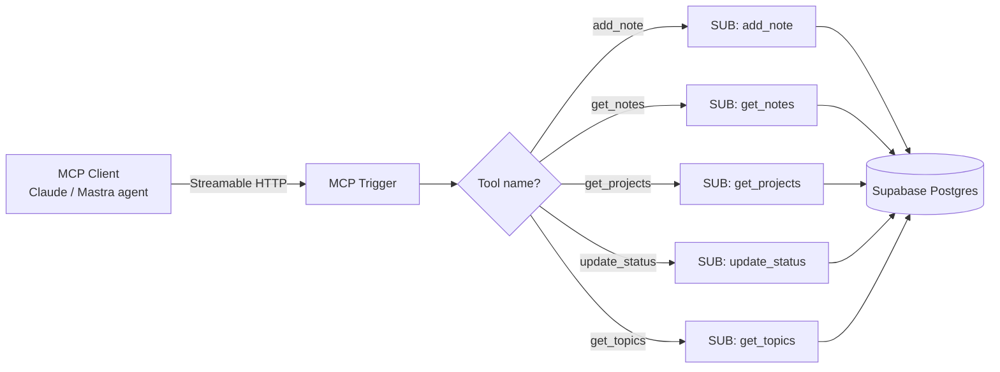
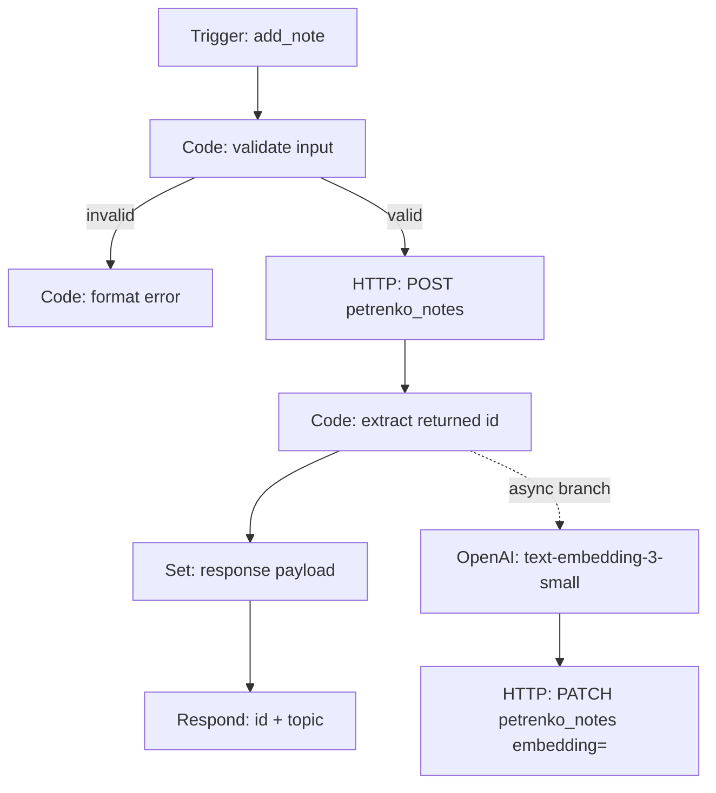
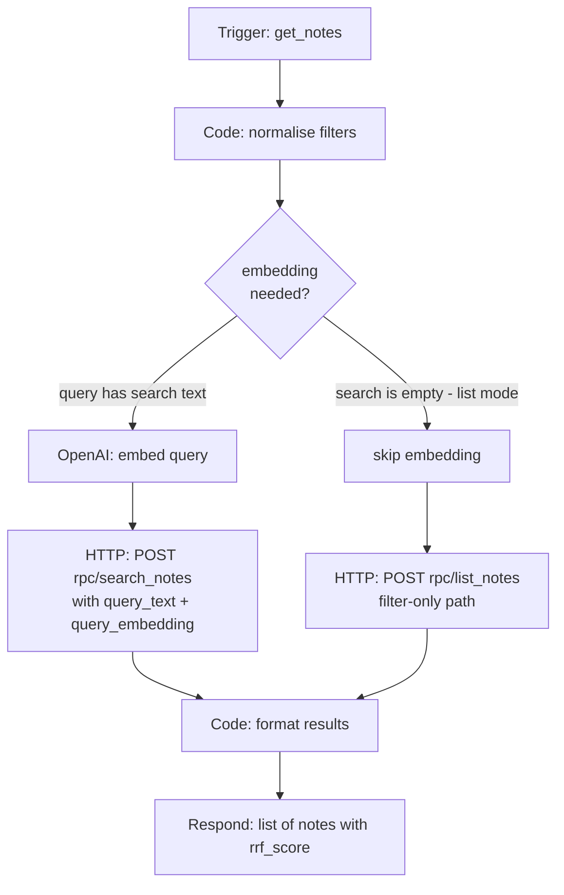
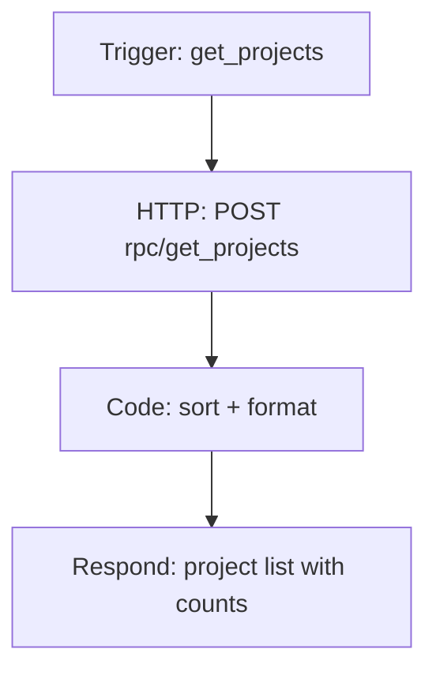
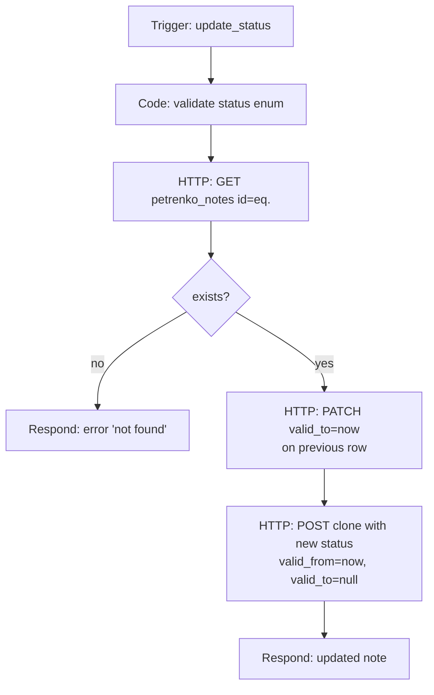
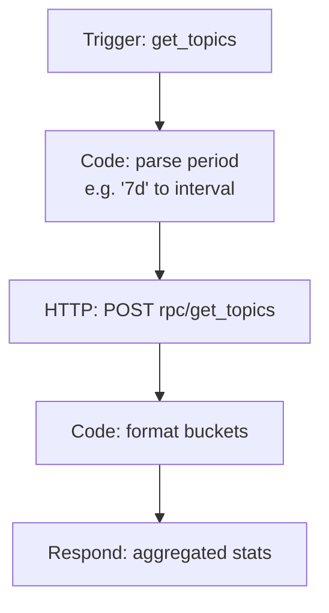

# n8n Workflow Architecture

This document describes the workflow structure behind `petrenko-notes-mcp`. The MCP server is implemented as one **main MCP Trigger workflow** that routes incoming tool calls to **5 isolated sub-workflows**, one per MCP tool.

Each sub-workflow handles its own validation, database operation, and response formatting, so a bug in one tool cannot affect the others.

---

## Top-level routing



The MCP Trigger node exposes 5 tool definitions via Streamable HTTP. Each tool's `inputSchema` is enforced at the trigger layer, so a malformed call never reaches a sub-workflow.

---

## SUB: add_note

Writes a new note. Embedding is generated **after** the write so the user-facing MCP call returns fast.



**Key design choices:**

- The user-facing response goes out **before** the embedding job finishes. Embedding adds 200-400ms; making it sync would block every MCP call.
- The embedding `PATCH` is fire-and-forget. If it fails, the note still exists and shows up in ILIKE/FTS searches. A nightly sweep re-tries notes with `embedding IS NULL`.
- `Code: validate input` rejects unknown enum values for `type`, `status`, `volatility` before the HTTP call, so Postgres CHECK constraints are never the first line of defence.

---

## SUB: get_notes

Hybrid 3-channel search. All the heavy lifting is in the Postgres RPC; the workflow is thin.



**Key design choices:**

- Two paths because not every read is a search. `get_notes(project='personal_career', status='new')` doesn't need an embedding round-trip — it's a filtered list.
- The RPC returns `rrf_score` alongside `similarity` so the calling agent can decide when results are weak ("found by tangent") and prompt the user to refine the query.
- `Code: normalise filters` collapses empty strings to `null` so Postgres filter clauses are clean. Without this, `WHERE type = ''` returns zero rows and looks like a bug.

---

## SUB: get_projects

Aggregates notes by project namespace with counts.



**Key design choices:**

- A single RPC instead of an n8n-level aggregation. Postgres does it faster and the result is small (< 100 rows usually).
- Sort happens in n8n so the RPC can stay generic.

---

## SUB: update_status

Marks a note as in_progress / done / cancelled. Updates are append-only — a status change writes a new row, the previous one keeps its `valid_to` timestamp.



**Key design choices:**

- Append-only means the history is queryable. "Show me notes that were `in_progress` last month but are `done` now" is just a `valid_from / valid_to` range query.
- Two writes per update is the trade-off. For a personal knowledge base with 10-30 changes per day, the volume is trivial.

---

## SUB: get_topics

Analytics — top projects, type distribution, recent themes for a time window.



**Key design choices:**

- The period parser accepts shorthand like `7d`, `30d`, `3m` — the calling agent never has to construct a timestamp.
- All aggregation is in Postgres. Pushing it to n8n would mean streaming thousands of rows over HTTP for a few summary numbers.

---

## Cross-cutting patterns

### 1. Always Output Data on HTTP nodes after search

n8n's default behaviour for HTTP nodes is to **not** emit anything if the response body is empty. For an MCP server this is a footgun: a sub-workflow that returns nothing causes the MCP Trigger to time out instead of returning a clean empty array.

Every HTTP node after a Supabase read has `Always Output Data: true` and a fallback structure in the `Code: format results` step.

### 2. No credential sharing across sub-workflows

Each sub-workflow has its own Supabase credential reference. If a credential is rotated, it can be swapped per-tool without touching others. This also means the MCP Trigger workflow itself has zero credentials — a small but useful blast-radius reduction.

### 3. Validation lives in Code nodes, not in the database

Postgres CHECK constraints catch bad data, but the error messages they return are unfriendly (`new row for relation "petrenko_notes" violates check constraint "petrenko_notes_type_check"`). Pre-validation in a Code node returns a structured MCP error that the agent can show the user verbatim.

### 4. Error format is consistent

Every sub-workflow returns one of two shapes:

```json
{ "ok": true, "data": { ... } }
```

or

```json
{ "ok": false, "error": { "code": "...", "message": "..." } }
```

The MCP client doesn't need to parse different error structures per tool.

---

## Why n8n and not a custom Python/FastAPI server

This is a fair question for a system that has 5 endpoints and could be 200 lines of Python.

The honest answer:

- **The other half of the platform is already in n8n.** The Knowledge Custodian, the news ingestion pipelines, the forecast layer — they all run as n8n workflows that share patterns, credentials, and observability. A separate FastAPI service would be a maintenance fork.
- **MCP Trigger support is first-class in n8n.** Streamable HTTP, schema validation, retry semantics — they're all there without writing transport code.
- **Prototyping is faster.** Workflows are testable per-node. n8n's `Pin Data` snapshots the output of any node so I can iterate downstream nodes without re-running the upstream chain — useful when refining a prompt or a transform without burning tokens. The FastAPI equivalent is fixtures plus pytest cycles. For exploratory work the n8n loop wins.
- **Observability is built in.** Every execution of every node is logged with full input, output, retry attempts, and timing. The FastAPI equivalent is `structlog` plus Sentry plus a custom run database, and even then debugging async branches in production takes more squinting than scrolling through n8n's executions panel.
- **Visual diffing of workflows is faster than reading git diffs for orchestration logic.** For pipelines with branching and async paths, the n8n UI is genuinely better than reading TypeScript.

The trade-off is performance and language flexibility. For a single-user knowledge layer with 10-30 writes/day, performance isn't a constraint. If it becomes one, the RPC layer (where all the heavy lifting already lives) doesn't need to move — only the thin orchestration around it.
